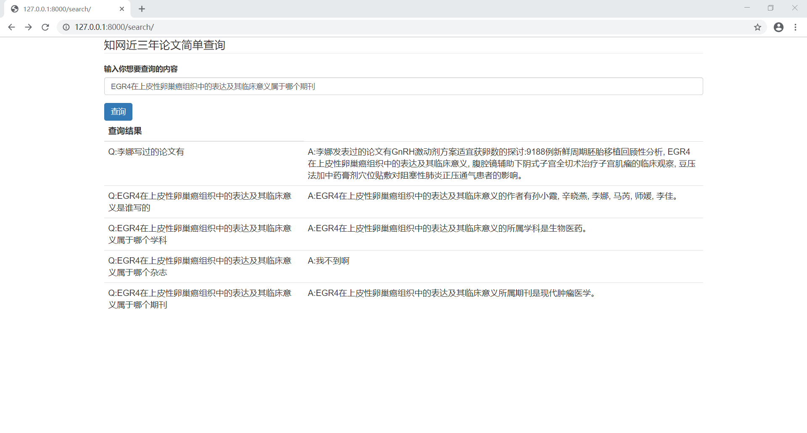

# 基于知识图谱的知网论文智能回答
### 操作环境
+ NEO4j
+ python 3.7
+ django 2.2
+ Win10

### 项目内容

利用neo4j，实现一个基于知识图谱关于知网近三年的论文智能查询，在WEB界面，用户在输入框中输入自己想要查询的内容(如“李娜写过哪些论文”)，查询内容传输到后台，得出答案，再通过ajax异步刷新到用户界面上。

### 实现方案
**后端部分：**
*demo.py*:首先将json中的每条数据提取并分析，总共提取出5类关键词：论文、作者、单位、杂志、和学科。然后将所有的关键词放入AC自动机。这样在用户输入查询问题字符串时就可以匹配到这写关键词。将关键词，关键词的属性，关键词节点于关键词节点之间的关系存入neo4j数据库中。

*question_classifer.py*:再设立6类关键词，每一类关键词可以对应到一类问题（6类问题）。分析用户输入的句子，将句子中的关键词，判别用户句子的问题类型。

*quesrtion_transfer.py*:针对不同的问题类型生成不同的sql语句，调入neo4j数据库，得出查询答案词。

*sql_answer.py*:针对不同的问题类型，将答案词填入到真正的回答句子。

**前端部分：**
Django中新建一个paper_search app。路由 ‘search/ ‘显示用户查询界面，用户查询的句子通过路由’search/s/?search=’发送GET请求到服务器，获取到搜索结果，再通过VUE-AJAX异步刷新到用户界面上。

### 实现结果
